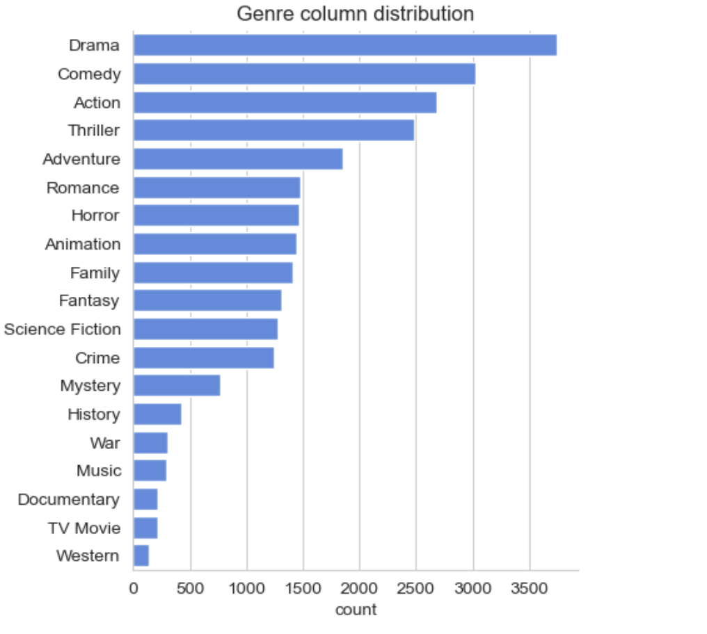
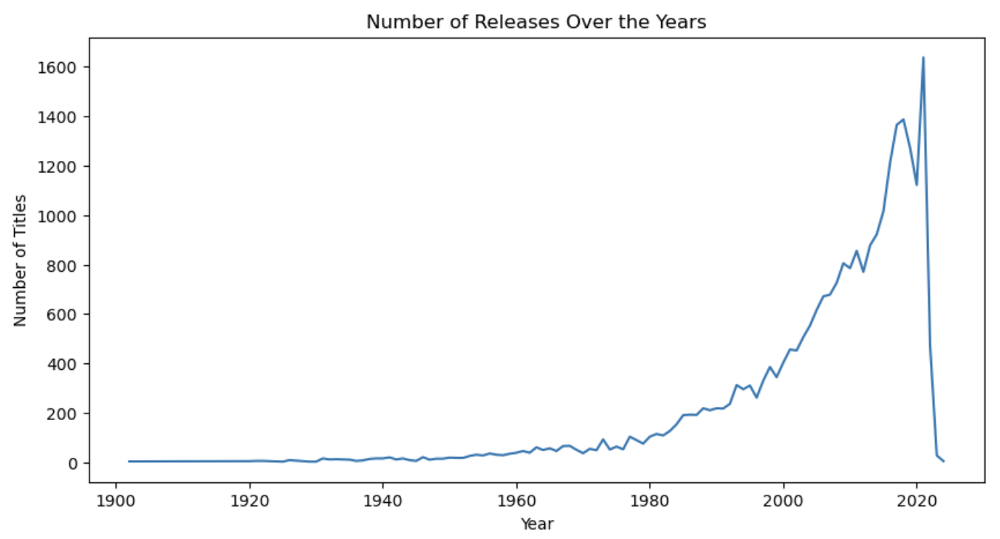
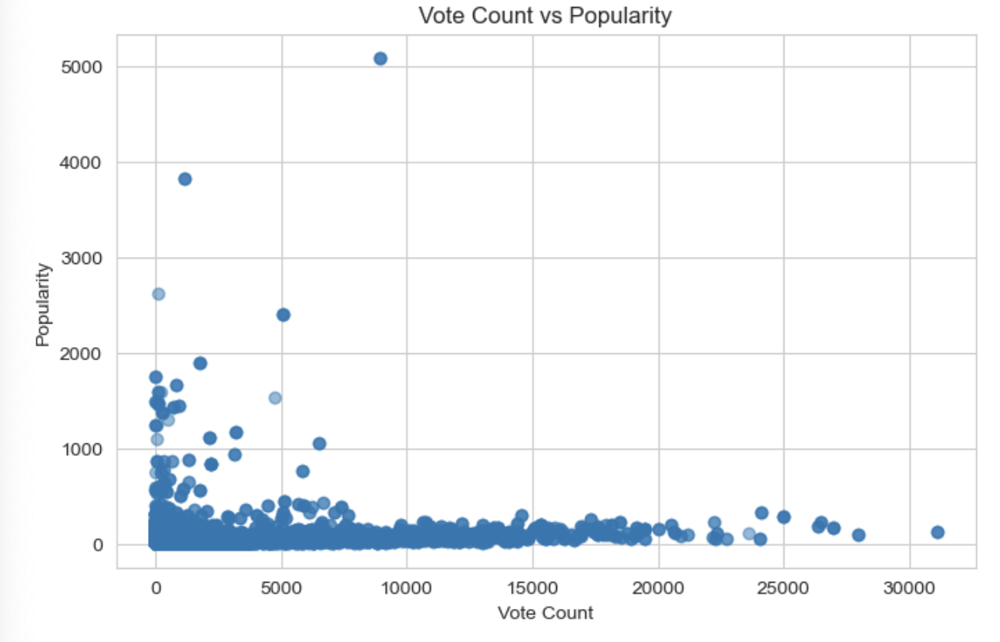
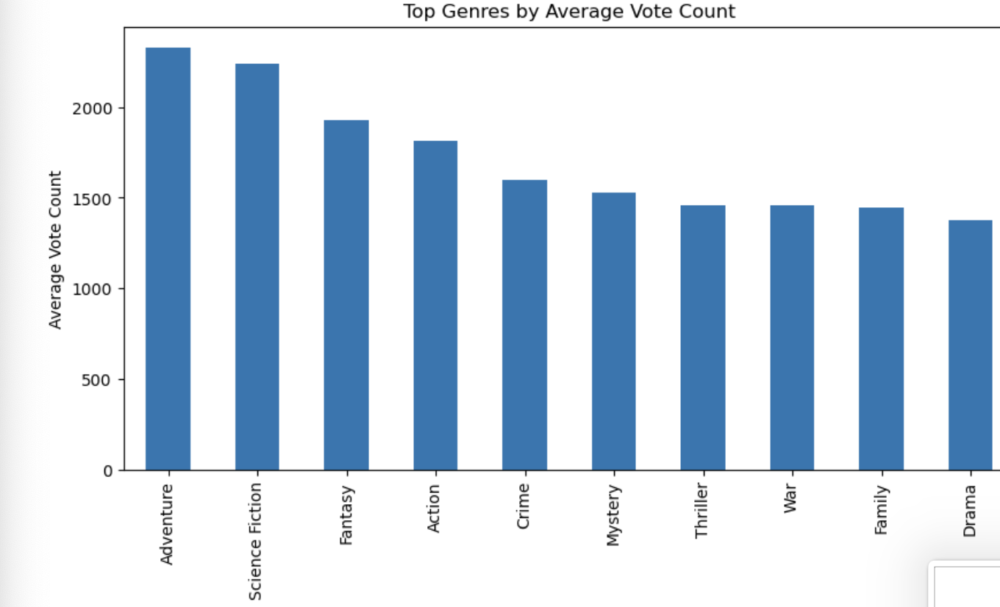
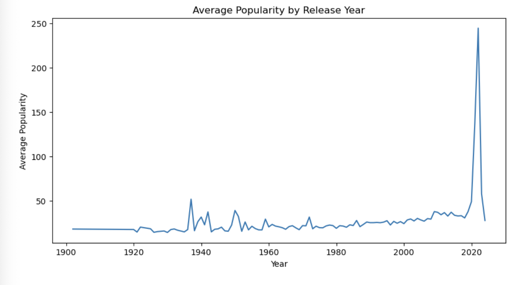
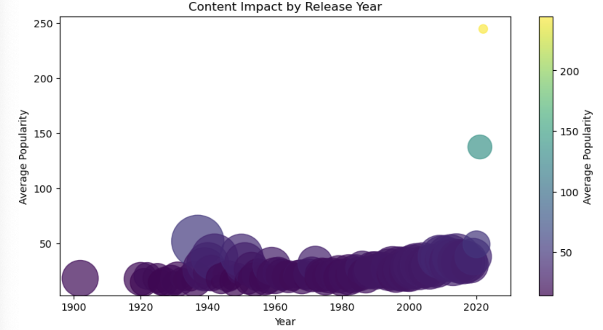
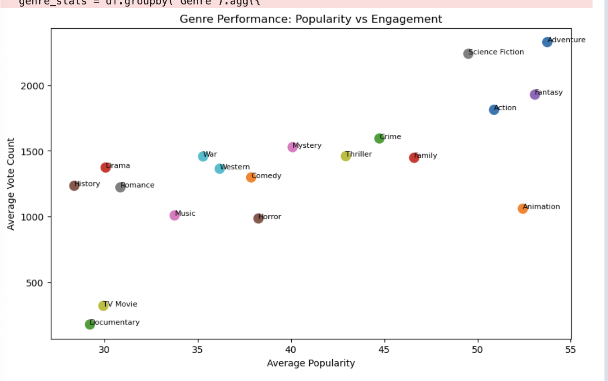
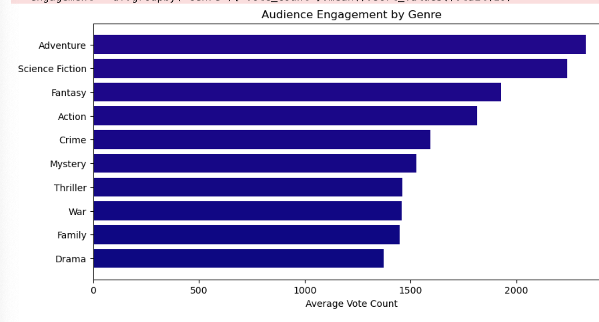

## 🎬 Netflix Movies: Deciphering the Blueprint of Streaming Success
## 📖 Project Overview
In a digital era where thousands of titles are released annually, Netflix operates in a highly saturated streaming market where viewer attention is the ultimate currency. This project explores a dataset of nearly 10,000 titles to understand the mechanics of digital success.

We journey through the evolution of cinema on the platform, translating raw metadata into a strategic narrative. By analyzing genres, popularity metrics, and audience engagement, this project serves as a data-driven compass for understanding how content survives and thrives in the modern age of streaming.

## 🛠️ The Technical Odyssey (Data Challenges)
The path from raw data to actionable insight was fraught with structural hurdles. To reach the "Greater Insights," the following engineering steps were required:

Genre Entanglement: The Genre column originally contained comma-separated strings with irregular spacing. I implemented a cleaning pipeline to strip whitespace and explode these strings into a categorical format, allowing for true per-genre analysis.

The Outlier Problem: The Popularity metric contained extreme outliers (blockbusters with scores in the thousands) that threatened to skew visualizations. I applied statistical clipping and normalization to ensure the trends reflected the majority of the library.

Temporal Precision: The Release_Date column was initially stored as text. I standardized this into a datetime format to extract "Year" and "Month" features, enabling the analysis of longitudinal trends and seasonal releases.

Feature Engineering (Quality Tiers): Raw numerical ratings (Vote_Average) were too granular for high-level business logic. I engineered a "Quality Tier" feature, segmenting movies into categories: Not Popular, Below Average, Average, and Popular.

Data Integrity: While the dataset lacked duplicates, several columns contained null (NaN) values. I performed a diagnostic sweep to handle missing narratives without losing the statistical significance of the remaining features.

## 📊 Visual Storytelling: Questions & Evidence
To navigate the data, we asked ten critical questions. Each visualization serves as the "evidence" for our findings.

## 1. What is the most frequent genre of movies released on netflix ?

Drama dominates Netflix’s catalog, likely because it’s a versatile genre that appeals to a wide audience and blends well with others (e.g., drama-comedy, drama-thriller).
## .How has Netflix content changed over the years?

The graph clearly shows that Netflix experienced exponential growth in content releases over time, with a sharp surge in the last decade. This trend reflects the platform’s strategic shift toward becoming a high-volume content producer.
When combined with genre analysis—where Drama dominates the catalog—it becomes evident that Netflix is not only increasing the quantity of content but also focusing on widely appealing genres to maximize viewer engagement.
The temporary drop in the most recent year is likely due to incomplete data rather than an actual decline.

## Is popularity related to vote count?

The scatter plot indicates a weak to moderate positive relationship between vote count and popularity. While some movies with higher vote counts tend to show increased popularity, the overall distribution is highly scattered, suggesting that vote count alone is not a strong predictor of popularity.
A large concentration of movies with low vote counts and low popularity highlights that most content receives limited engagement. However, a few outliers with very high vote counts demonstrate significantly higher popularity, indicating that widely viewed or promoted movies can achieve strong visibility.
## Which genres tend to receive higher ratings?

The analysis shows that genres such as Adventure, Science Fiction, and Fantasy receive the highest average vote counts, indicating stronger audience engagement and wider appeal. These genres often feature high production value, immersive storytelling, and global audience interest, which contribute to higher interaction levels.
In contrast, traditionally dominant genres like Drama, despite having the highest number of titles, show comparatively lower average vote counts. This suggests that while Drama is widely produced, it does not consistently generate the same level of audience engagement per title.

## Do newer movies perform better than older ones?

The graph indicates that newer movies generally achieve higher average popularity compared to older ones, particularly in recent years where there is a noticeable upward trend.
While older movies maintain relatively stable but lower popularity levels, recent releases show increased visibility and engagement, likely driven by:
Improved recommendation algorithms
Stronger marketing and platform promotion
Higher accessibility and recency bias among viewers
## Which years produced the most impactful movies?

The visualization shows that recent years—particularly post-2015—produced the most impactful movies, as indicated by higher average popularity (y-axis) and larger bubble sizes (vote count).
A few standout years near the present exhibit exceptionally high popularity scores, suggesting the release of highly successful or widely viewed titles. These peaks indicate periods where Netflix delivered content that strongly resonated with audiences.
## Which genres balance both popularity AND engagement?

The scatter plot reveals that Adventure, Science Fiction, and Action are the top-performing genres that successfully balance both high popularity and strong audience engagement (vote count). These genres appear in the upper-right region of the chart, indicating consistent performance across both metrics.
Genres like Fantasy also perform well but slightly trail behind in engagement compared to the top three. Meanwhile, genres such as Drama and Comedy, despite being widely produced, show moderate performance—indicating high availability but relatively average engagement.
## How does audience engagement change over time?

Audience engagement has steadily increased over time, with a clear rise in recent years. Earlier periods show low and stable engagement, while modern content receives significantly higher interaction due to increased accessibility, platform growth, and global reach.
The sharp drop in the latest year is likely due to incomplete data.

## Which genres generate the highest audience engagement?

Genres such as Adventure, Science Fiction, and Fantasy generate the highest audience engagement, as reflected by their top average vote counts. These genres consistently attract larger audiences due to their high entertainment value and global appeal.
In contrast, genres like Drama and Family, while widely produced, show comparatively lower engagement per title.

## 💡 Greater Insights & Strategic Conclusions
Beyond the charts, three "Greater Insights" emerged from this study:

The Hybrid Content Strategy: Netflix is no longer just a library; it is a barbell economy. One side focuses on high-budget "tentpole" genres (Action/Sci-Fi) to attract new users, while the other side focuses on high-volume, niche content (Documentaries/Indie) to keep them from canceling.

Marketing vs. Merit: The "Popularity" metric is a reflection of Netflix's internal promotion, while "Vote Count" is a reflection of the movie's merit. When these two diverge, it reveals a "marketing mismatch"—content that people were told to like but didn't actually value.

The Global Shift: The increasing diversity in both genre and language suggests that the "Netflix Era" of cinema is defined by the breaking of borders. A movie's success is now measured by its ability to translate across cultures, not just its performance in a single domestic market.

## 🏁 Conclusion
The data tells a story of a platform that has mastered the art of the "Digital Attention Economy." While blockbusters drive the headlines, the true strength of Netflix lies in its ability to balance mass-market appeal with niche-specific diversity. This project proves that success in the streaming age is a delicate balance of recency, genre-relevance, and genuine audience engagement.
